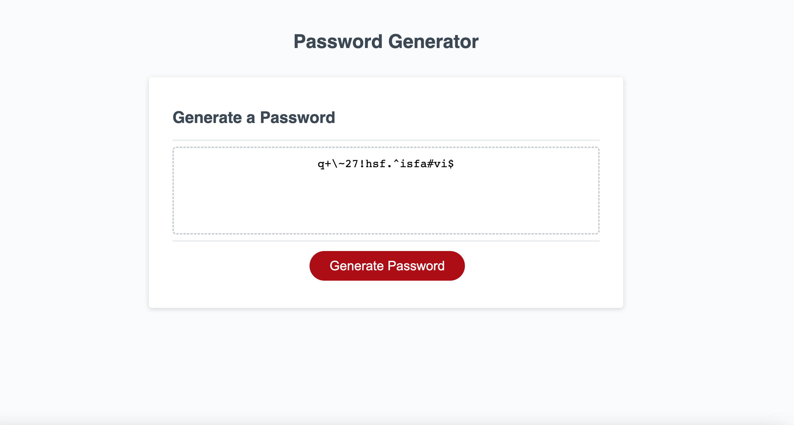

# password-generator

## Description 

This is an application that generators ramdom passwords based on user's requirement. The started code containing HTML and CSS is provided, the challenge here was to build the logic. Give it try !!

* Click on the "Genarate Password" button to start.
* Then it asks for password length, we have considered a password length range of 8 or greater and 128 or smaller. If you select a length other than this then it gives an alert box asking to select the specified range. 
* Then it asks for a series of questions to select special characters, numbers, small letters and capital letters. 
* If not a single character is selected then it gives an alert message and then the program starts over.
* At last, it generates the password based on user requirements.

## Features

* It is responsive, this feature is implemented in the starter code. 
* Rest of the features are same as explained in the description, please refer above.

## Installation

N/A

## Screenshot

## Link to the deployed application

https://suvarna28.github.io/password-generator/

## Credits

* Myles Smith, for discussing his logic and approach in the class while discussing the challenge. The logic is based on his approach
* Our Instructor Gabrial Perry, for discussing Myles's approach

